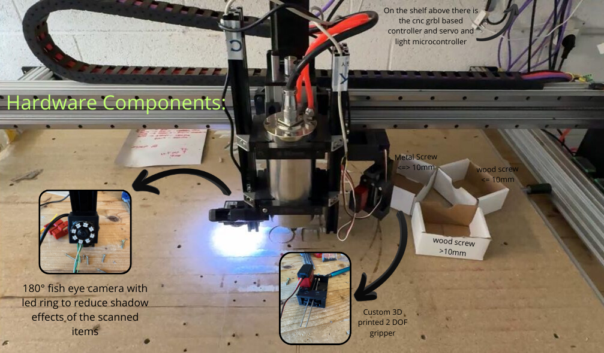
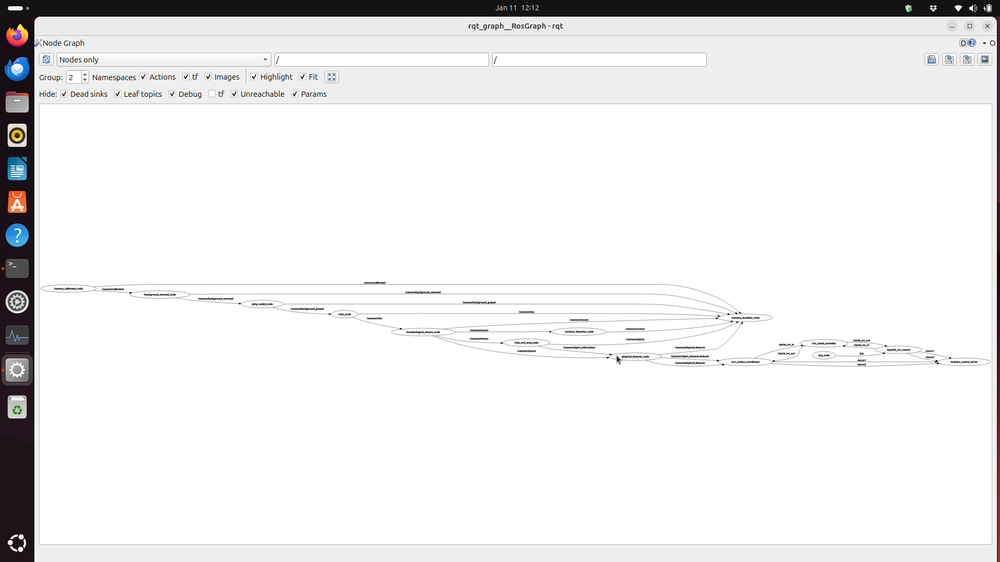
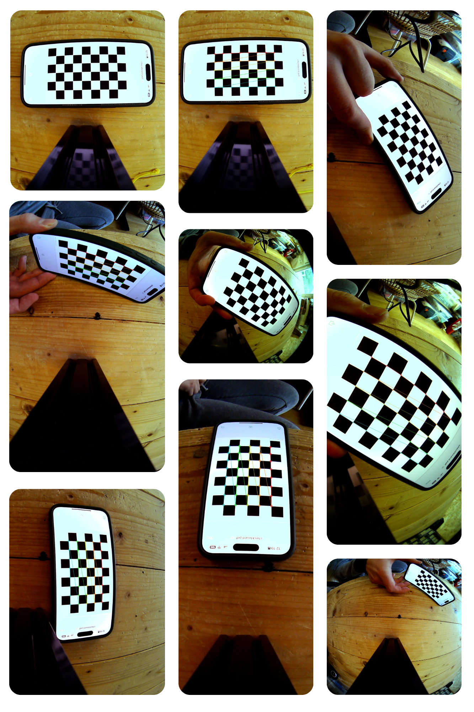

# 🛠️ CNC Pick & Place Demonstration

A computer vision-based robotic pick-and-place system combining ROS2 and OpenCV for automated object detection and manipulation.

---

## 📹 Demo Video

[](https://youtu.be/EGnl93jBOss)

---

## 📖 Project Overview

This project was developed as the final assignment for the Signal, Image and Video Processing course at the University of Trento. It combines computer vision techniques with robotic control to create an automated pick-and-place system using a CNC machine.

---

## 🏗️ Architecture

The system leverages two primary frameworks:

* **ROS2**: Provides modular architecture for separating vision and robotic control, improving code quality and development workflow

* **Python + OpenCV**: Handles all image processing and computer vision tasks

### ROS2 Package Structure

The project is organized into the following ROS2 packages (source code located in the `src` folder):

For those unfamiliar with ROS2:

* **Packages**: Macro-level folders containing related functionality

* **Nodes**: Individual programs performing specific tasks

* **Topics**: Asynchronous message passing between nodes (publish/subscribe)

* **Services**: Synchronous client-server communication


#### 📦 **Arduino Control Package**

Interfaces with Arduino hardware to control:

* Servo motors

* Camera lighting system

#### 📦 **Camera Calibration Package**

Performs camera calibration using:

* Chessboard pattern detection

* OpenCV calibration algorithms

#### 📦 **CNC Control Package**

Manages CNC machine communication:

* G-code command interface

* ROS2 publishers/subscribers for movement control

* Exposes CNC functionality to the ROS2 ecosystem

#### 📦 **Camera Package**

Comprehensive vision processing module containing multiple nodes for:

* Camera interfacing via OpenCV

* Step by step image processing filter application

* Advanced image processing features we will discuss in detail below

#### 📦 **Services & Bringup Packages**

Utility packages providing:

* Bringup: Launch files for multi-node startup

* Custom services for light control

* Gripper servo control services

---

## Hardware components
The hardware setup is straightforward. At its core, we have a 3-axis CNC machine that serves as the movement platform. Mounted on the Z-axis is a camera that captures the workspace from above, providing the visual input for our computer vision system. An Arduino board acts as the interface between the high-level control and the physical actuators, managing both the servo motors for the gripper and the lighting system that ensures consistent image quality. All of this is orchestrated by a computer running the ROS2 nodes and executing the computer vision algorithms in real-time. 



---

## Software Pipeline
In this section, we'll dive into the vision processing pipeline that powers the system. The Camera Package contains the core nodes responsible for image acquisition, processing, and object detection. These nodes communicate seamlessly through ROS2 topics, creating a distributed yet cohesive system. We'll also touch on the CNC control mechanisms for those interested in the mechanical side of the operation.

Below is the rqt_graph visualization showing how all the nodes interact within the system. I know the image is not clear enough, I will describe everything in detail anyway ;)


---

## Camera package

### Camera Node - Linux Native

This ROS2 camera node provides high-resolution video capture with dual-output streaming. It captures frames from a USB camera at full resolution (3264×2448 @ 15 fps) using V4L2 and MJPEG encoding, then publishes both raw and compressed images to ROS2 topics at a configurable rate (default 5 Hz). 

**Core Functionality:**
- **Multi-threaded capture**: Dedicated thread continuously reads frames from the camera to minimize latency and prevent buffer buildup
- **Dual streaming**: Publishes full-resolution images to `camera/image_raw` and downscaled compressed images (1280×720) to `camera/image_raw/compressed`
- **Web interface**: Built-in Flask server provides an MJPEG stream viewable in any browser at `http://localhost:8000`
- **Performance monitoring**: Real-time FPS tracking and stats endpoint for diagnostics
- **Efficient encoding**: Rate-limited JPEG encoding prevents CPU overload while maintaining smooth 15 fps streaming


From this point, the image processing pipeline begins with ( `camera_node` ) → `camera/image_raw` topic as the source for all downstream filters and computer vision nodes. 

--- 

## Camera calibration package: 
From this point we change package for a moment because we need to calibrate the camera in order to be able to compute real world coordinates from pixel coordinates. 

### capture images node
  
This utility script provides an interactive command-line interface for manually capturing individual frames from the camera stream. It connects to the Flask web server's `/frame` endpoint and saves high-quality JPEG snapshots on demand.  
  
**Core Functionality:**  
- **Spacebar capture**: Press spacebar to instantly grab and save a frame without needing to press Enter  
- **Sequential naming**: Automatically names files as `frame_0001.jpg`, `frame_0002.jpg`, etc. in the `../images` directory  

### Fisheye Camera Calibration Service

This ROS2 service node performs automated fisheye camera calibration using chessboard pattern images. It processes a collection of calibration images, detects chessboard corners, and computes the camera's intrinsic parameters and distortion coefficients using OpenCV's fisheye calibration model.

**Core Functionality:**
- **ROS2 service interface**: Exposes `/run_fisheye_calibration` service (std_srvs/Trigger) for on-demand calibration
- **Multi-strategy corner detection**: Employs three detection methods with different preprocessing techniques (histogram equalization, CLAHE, adaptive thresholding) to maximize successful chessboard detection
- **Robust preprocessing**: Applies contrast enhancement and noise reduction to handle challenging lighting conditions and screen-captured patterns
- **Fisheye-specific calibration**: Uses `cv2.fisheye.calibrate()` with appropriate flags for wide-angle lens distortion modeling
- **Visual feedback**: Generates postprocessed images showing detected corners (green) or failed detections (red) for debugging
- **YAML output**: Saves calibration results in ROS-compatible YAML format including camera matrix (K), distortion coefficients (D), and reprojection error

**Parameters:**
- `images_dir`: Directory containing calibration images (default: `../images`)
- `pattern_cols` / `pattern_rows`: Number of inner corners in chessboard (default: 8×5)
- `square_size`: Physical size of chessboard squares in meters (default: 0.025m = 25mm)
- `output_file`: Path to save calibration YAML (default: `fisheye_camera.yaml`)
- `visualize`: Show real-time corner detection (default: false)
- `save_postprocessed`: Save annotated images with detection results (default: true)

**Usage:**
```bash
ros2 service call /run_fisheye_calibration std_srvs/srv/Trigger "{}"
```

---

### Multi-Strategy Corner Detection & Preprocessing

The calibration node implements a three-tier fallback detection system to handle various image quality conditions:

#### Strategy 1: Histogram Equalization + Gaussian Blur

```python
# Convert to grayscale
gray = cv2.cvtColor(img, cv2.COLOR_BGR2GRAY)

# 1. Histogram equalization for better contrast
gray_eq = cv2.equalizeHist(gray)

# 2. Slight blur to reduce noise
gray_processed = cv2.GaussianBlur(gray_eq, (5, 5), 0)

# Try detection with preprocessing
ret, corners = cv2.findChessboardCorners(
    gray_processed,
    pattern_size,
    flags=cv2.CALIB_CB_ADAPTIVE_THRESH
          + cv2.CALIB_CB_NORMALIZE_IMAGE
          + cv2.CALIB_CB_FILTER_QUADS
)
```

**Purpose**: Histogram equalization redistributes pixel intensities to improve contrast, especially useful for images with poor lighting. Gaussian blur reduces high-frequency noise that can interfere with corner detection.

#### Strategy 2: Fallback to Original Grayscale
```python
# If failed, try without FAST_CHECK on original gray
if not ret:
    self.get_logger().info(f"  Trying alternative detection method...")
    ret, corners = cv2.findChessboardCorners(
        gray,
        pattern_size,
        flags=cv2.CALIB_CB_ADAPTIVE_THRESH
              + cv2.CALIB_CB_NORMALIZE_IMAGE
    )
```
**Purpose**: Sometimes preprocessing can over-smooth or distort the pattern. This fallback uses the raw grayscale image with fewer flags, removing `CALIB_CB_FILTER_QUADS` which can be too aggressive.

#### Strategy 3: CLAHE (Contrast Limited Adaptive Histogram Equalization)
```python
# Try with different preprocessing
if not ret:
    self.get_logger().info(f"  Trying with CLAHE preprocessing...")
    clahe = cv2.createCLAHE(clipLimit=2.0, tileGridSize=(8, 8))
    gray_clahe = clahe.apply(gray)
    ret, corners = cv2.findChessboardCorners(
        gray_clahe,
        pattern_size,
        flags=cv2.CALIB_CB_ADAPTIVE_THRESH
              + cv2.CALIB_CB_NORMALIZE_IMAGE
    )
```

**Purpose**: CLAHE performs localized histogram equalization in 8×8 tiles, preventing over-amplification of noise in uniform regions. The `clipLimit=2.0` prevents excessive contrast enhancement. This is particularly effective for images with uneven lighting or screen glare.


