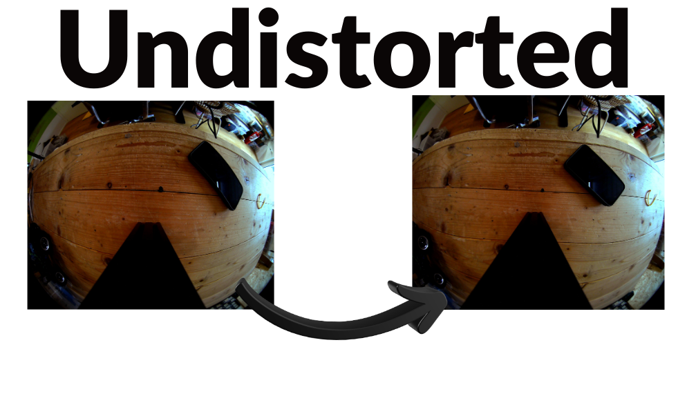
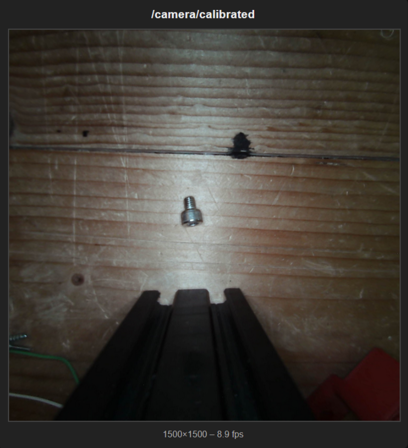
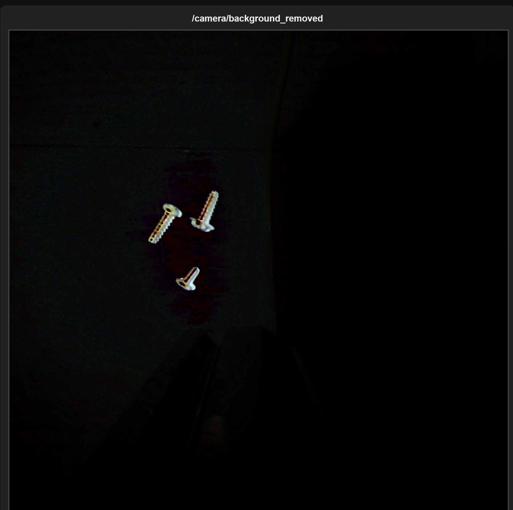
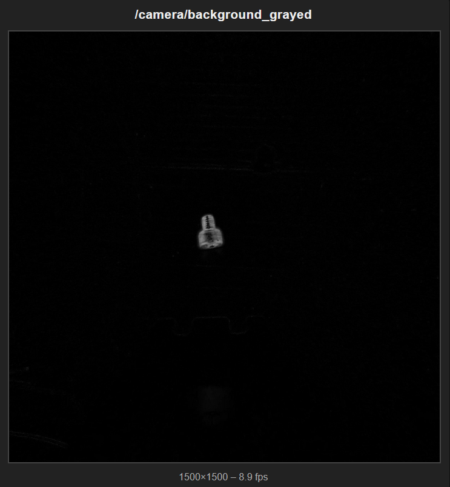
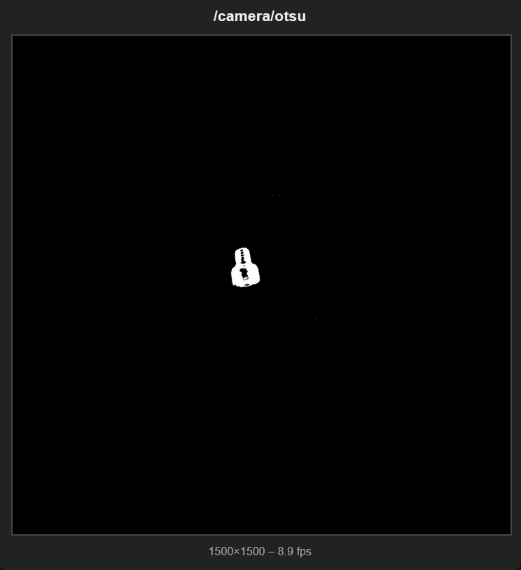
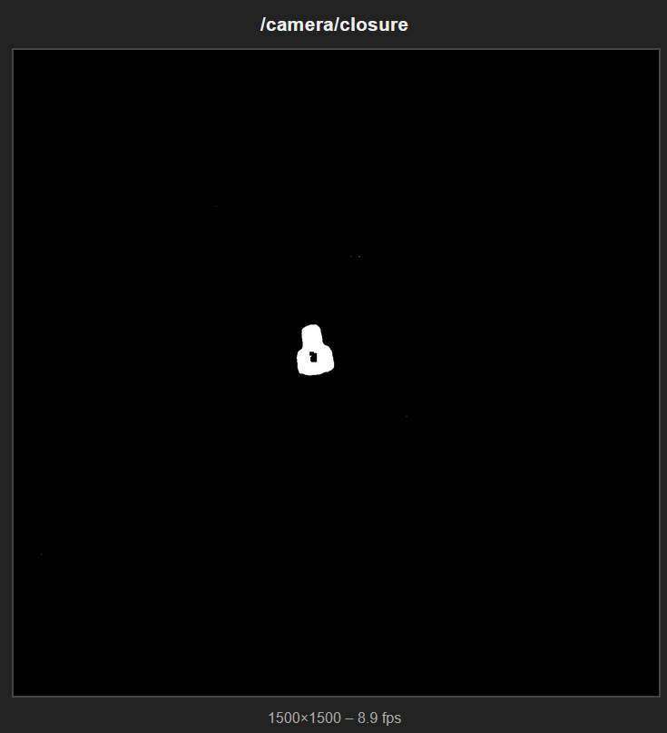
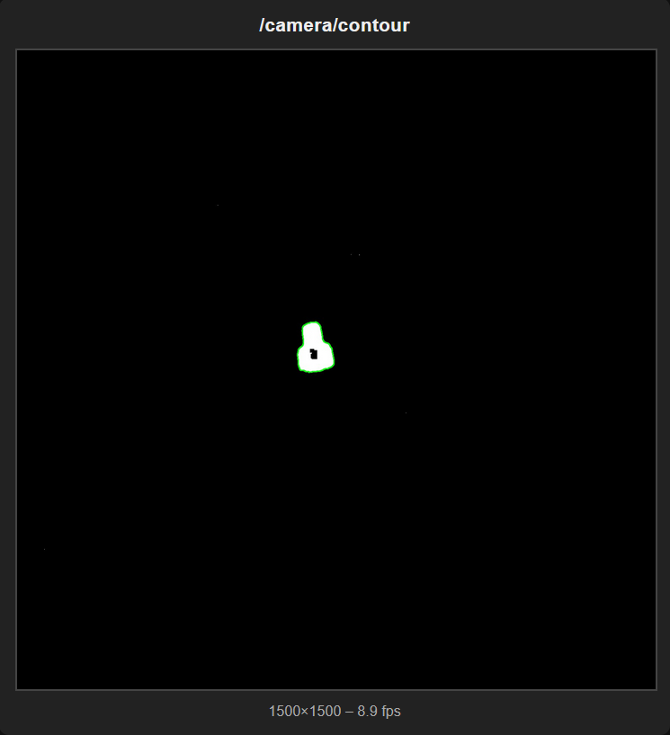
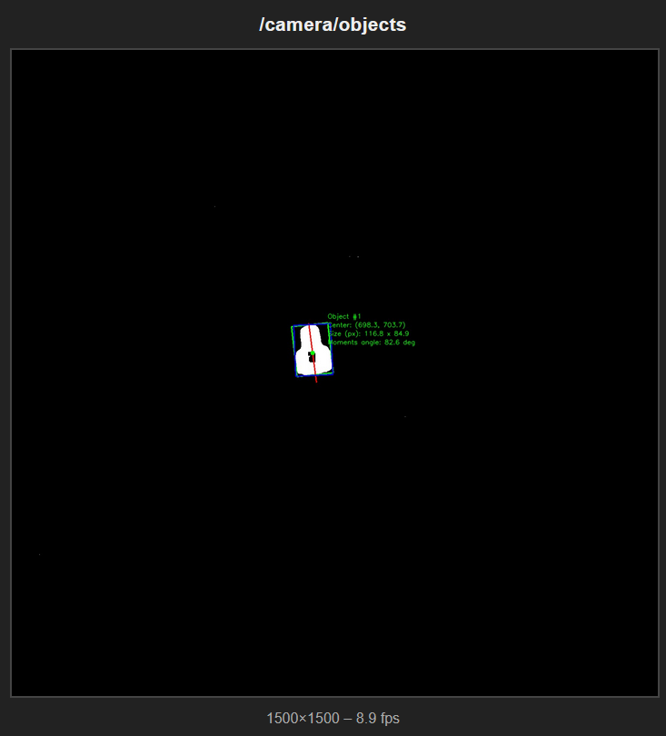
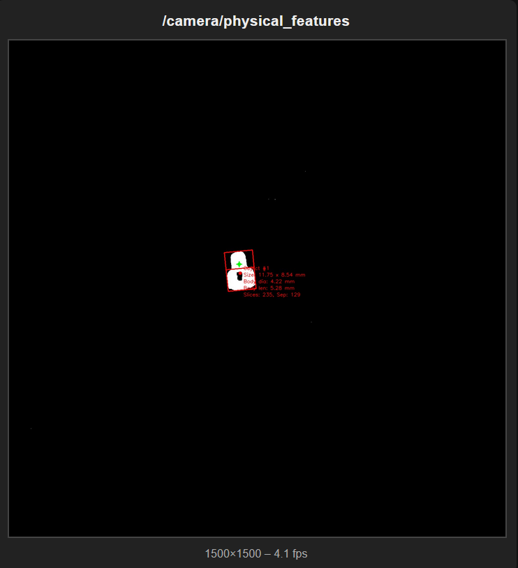

# 🛠️ CNC Pick & Place Demonstration

A computer vision-based robotic pick-and-place system combining ROS2 and OpenCV for automated object detection and manipulation.

---

## 📹 Demo Video

[](https://youtu.be/EGnl93jBOss)

---

## 📖 Project Overview

This project was developed as the final assignment for the Signal, Image and Video Processing course at the University of Trento. It combines computer vision techniques with robotic control to create an automated pick-and-place system using a CNC machine.

---

## 🏗️ Architecture

The system leverages two primary frameworks:

* **ROS2**: Provides modular architecture for separating vision and robotic control, improving code quality and development workflow

* **Python + OpenCV**: Handles all image processing and computer vision tasks

### ROS2 Package Structure

The project is organized into the following ROS2 packages (source code located in the `src` folder):

For those unfamiliar with ROS2:

* **Packages**: Macro-level folders containing related functionality

* **Nodes**: Individual programs performing specific tasks

* **Topics**: Asynchronous message passing between nodes (publish/subscribe)

* **Services**: Synchronous client-server communication


#### 📦 **Arduino Control Package**

Interfaces with Arduino hardware to control:

* Servo motors

* Camera lighting system

#### 📦 **Camera Calibration Package**

Performs camera calibration using:

* Chessboard pattern detection

* OpenCV calibration algorithms

#### 📦 **CNC Control Package**

Manages CNC machine communication:

* G-code command interface

* ROS2 publishers/subscribers for movement control

* Exposes CNC functionality to the ROS2 ecosystem

#### 📦 **Camera Package**

Comprehensive vision processing module containing multiple nodes for:

* Camera interfacing via OpenCV

* Step by step image processing filter application

* Advanced image processing features we will discuss in detail below

#### 📦 **Services & Bringup Packages**

Utility packages providing:

* Bringup: Launch files for multi-node startup

* Custom services for light control

* Gripper servo control services

---

## Hardware components
The hardware setup is straightforward. At its core, we have a 3-axis CNC machine that serves as the movement platform. Mounted on the Z-axis is a camera that captures the workspace from above, providing the visual input for our computer vision system. An Arduino board acts as the interface between the high-level control and the physical actuators, managing both the servo motors for the gripper and the lighting system that ensures consistent image quality. All of this is orchestrated by a computer running the ROS2 nodes and executing the computer vision algorithms in real-time. 


---

## Software Pipeline
In this section, we'll dive into the vision processing pipeline that powers the system. The Camera Package contains the core nodes responsible for image acquisition, processing, and object detection. These nodes communicate seamlessly through ROS2 topics, creating a distributed yet cohesive system. We'll also touch on the CNC control mechanisms for those interested in the mechanical side of the operation.

Below is the rqt_graph visualization showing how all the nodes interact within the system. I know the image is not clear enough, I will describe everything in detail anyway ;)


---

## Camera package

### Camera Node - Linux Native

This ROS2 camera node provides high-resolution video capture with dual-output streaming. It captures frames from a USB camera at full resolution (3264×2448 @ 15 fps) using V4L2 and MJPEG encoding, then publishes both raw and compressed images to ROS2 topics at a configurable rate (default 5 Hz). 

**Core Functionality:**
- **Multi-threaded capture**: Dedicated thread continuously reads frames from the camera to minimize latency and prevent buffer buildup
- **Dual streaming**: Publishes full-resolution images to `camera/image_raw` and downscaled compressed images (1280×720) to `camera/image_raw/compressed`
- **Web interface**: Built-in Flask server provides an MJPEG stream viewable in any browser at `http://localhost:8000`
- **Performance monitoring**: Real-time FPS tracking and stats endpoint for diagnostics
- **Efficient encoding**: Rate-limited JPEG encoding prevents CPU overload while maintaining smooth 15 fps streaming


From this point, the image processing pipeline begins with ( `first_camera_node_linux_native.py` ) → `camera/image_raw` topic as the source for all downstream filters and computer vision nodes. 

--- 

## Camera calibration package: 
From this point we change package for a moment because we need to calibrate the camera in order to be able to compute real world coordinates from pixel coordinates. 

### capture images node
  
This utility script provides an interactive command-line interface for manually capturing individual frames from the camera stream. It connects to the Flask web server's `/frame` endpoint and saves high-quality JPEG snapshots on demand.  
  
**Core Functionality:**  
- **Spacebar capture**: Press spacebar to instantly grab and save a frame without needing to press Enter  
- **Sequential naming**: Automatically names files as `frame_0001.jpg`, `frame_0002.jpg`, etc. in the `../images` directory  

### Fisheye Camera Calibration Service

This ROS2 service node performs automated fisheye camera calibration using chessboard pattern images. It processes a collection of calibration images, detects chessboard corners, and computes the camera's intrinsic parameters and distortion coefficients using OpenCV's fisheye calibration model.

**Core Functionality:**
- **ROS2 service interface**: Exposes `/run_fisheye_calibration` service (std_srvs/Trigger) for on-demand calibration
- **Multi-strategy corner detection**: Employs three detection methods with different preprocessing techniques (histogram equalization, CLAHE, adaptive thresholding) to maximize successful chessboard detection
- **Robust preprocessing**: Applies contrast enhancement and noise reduction to handle challenging lighting conditions and screen-captured patterns
- **Fisheye-specific calibration**: Uses `cv2.fisheye.calibrate()` with appropriate flags for wide-angle lens distortion modeling
- **Visual feedback**: Generates postprocessed images showing detected corners (green) or failed detections (red) for debugging
- **YAML output**: Saves calibration results in ROS-compatible YAML format including camera matrix (K), distortion coefficients (D), and reprojection error

**Parameters:**
- `images_dir`: Directory containing calibration images (default: `../images`)
- `pattern_cols` / `pattern_rows`: Number of inner corners in chessboard (default: 8×5)
- `square_size`: Physical size of chessboard squares in meters (default: 0.025m = 25mm)
- `output_file`: Path to save calibration YAML (default: `fisheye_camera.yaml`)
- `visualize`: Show real-time corner detection (default: false)
- `save_postprocessed`: Save annotated images with detection results (default: true)

**Usage:**
```bash
ros2 service call /run_fisheye_calibration std_srvs/srv/Trigger "{}"
```

---

### Multi-Strategy Corner Detection & Preprocessing

The calibration node implements a three-tier fallback detection system to handle various image quality conditions:

#### Strategy 1: Histogram Equalization + Gaussian Blur

```python
# Convert to grayscale
gray = cv2.cvtColor(img, cv2.COLOR_BGR2GRAY)

# 1. Histogram equalization for better contrast
gray_eq = cv2.equalizeHist(gray)

# 2. Slight blur to reduce noise
gray_processed = cv2.GaussianBlur(gray_eq, (5, 5), 0)

# Try detection with preprocessing
ret, corners = cv2.findChessboardCorners(
    gray_processed,
    pattern_size,
    flags=cv2.CALIB_CB_ADAPTIVE_THRESH
          + cv2.CALIB_CB_NORMALIZE_IMAGE
          + cv2.CALIB_CB_FILTER_QUADS
)
```

**Purpose**: Histogram equalization redistributes pixel intensities to improve contrast, especially useful for images with poor lighting. Gaussian blur reduces high-frequency noise that can interfere with corner detection.

#### Strategy 2: Fallback to Original Grayscale
```python
# If failed, try without FAST_CHECK on original gray
if not ret:
    self.get_logger().info(f"  Trying alternative detection method...")
    ret, corners = cv2.findChessboardCorners(
        gray,
        pattern_size,
        flags=cv2.CALIB_CB_ADAPTIVE_THRESH
              + cv2.CALIB_CB_NORMALIZE_IMAGE
    )
```
**Purpose**: Sometimes preprocessing can over-smooth or distort the pattern. This fallback uses the raw grayscale image with fewer flags, removing `CALIB_CB_FILTER_QUADS` which can be too aggressive.

#### Strategy 3: CLAHE (Contrast Limited Adaptive Histogram Equalization)
```python
# Try with different preprocessing
if not ret:
    self.get_logger().info(f"  Trying with CLAHE preprocessing...")
    clahe = cv2.createCLAHE(clipLimit=2.0, tileGridSize=(8, 8))
    gray_clahe = clahe.apply(gray)
    ret, corners = cv2.findChessboardCorners(
        gray_clahe,
        pattern_size,
        flags=cv2.CALIB_CB_ADAPTIVE_THRESH
              + cv2.CALIB_CB_NORMALIZE_IMAGE
    )
```

**Purpose**: CLAHE performs localized histogram equalization in 8×8 tiles, preventing over-amplification of noise in uniform regions. The `clipLimit=2.0` prevents excessive contrast enhancement. This is particularly effective for images with uneven lighting or screen glare.


--- 
## Back to camera package

#### Calibrated Camera Node

This ROS2 node subscribes to raw fisheye camera images on `/camera/image_raw`, applies fisheye undistortion using pre-calibrated parameters from `fisheye_camera.yaml`, and performs a fixed center crop (1500×1500 pixels) to produce a rectified output. The undistortion maps are precomputed at startup using OpenCV's cv2.fisheye module with a balance parameter of 0.0 for minimal distortion. The processed image is published to `/camera/calibrated`, accompanied by an adjusted CameraInfo message on `/camera/calibrated/camera_info` that reflects the cropped intrinsics and zero distortion model. This pipeline ensures downstream nodes receive geometrically corrected images with accurate camera parameters for tasks like visual odometry or object detection.



```python
# FIXED CENTER CROP SIZE (pixels)
CROP_W = 1500   # width
CROP_H = 1500   # height
```

```python
def undistort_and_center_crop(img):
    """Apply undistortion and center crop to the image."""
    global stats

    if img is None:
        return None, None, None, None

    # Ensure size matches calibration
    if img.shape[1] != W or img.shape[0] != H:
        img = cv2.resize(img, (W, H))

    # Apply fisheye undistortion using precomputed maps
    und = cv2.remap(img, map1, map2, cv2.INTER_LINEAR)

    # Calculate center crop coordinates
    cx = W // 2
    cy = H // 2

    x1 = cx - CROP_W // 2
    x2 = cx + CROP_W // 2
    y1 = cy - CROP_H // 2
    y2 = cy + CROP_H // 2

    # Safety clamp to image boundaries
    x1 = max(0, x1)
    y1 = max(0, y1)
    x2 = min(W, x2)
    y2 = min(H, y2)

    # Extract cropped region
    cropped = und[y1:y2, x1:x2]

    stats["frames_processed"] += 1

    return cropped, x1, y1, (x2 - x1, y2 - y1)
```


The pipeline so far is ( `first_camera_node_linux_native.py` ) → `camera/image_raw` -> ( `calibrated_camera_node.py` ) → `camera/calibrated` topic as the source for all downstream filters and computer vision nodes.
This is the undistorted and cropped image, as we can see this only properly worked in the center of the image. This doesn't constitute a problem for our use case since all the screws and bolts are in the center of the image and the image cropped at 1500 px square.



---

#### Background Removal Node

This ROS2 node subscribes to calibrated camera images on `/camera/calibrated`, captures the first received frame as a static background reference, and publishes the absolute pixel difference between subsequent frames and that background to `/camera/background_removed`. The background image is automatically saved to `ros2_ws/src/camera_pkg/background.jpg`. This simple yet effective approach isolates objects or changes in the scene by subtracting the static environment, making it ideal for detecting new screws, bolts, or other components placed on a fixed surface.



```python
# Background capture on first frame
if self.background is None:
    # First frame: store as background and save to disk
    self.background = cv_img.copy()
    try:
        # Ensure directory exists
        os.makedirs(os.path.dirname(self.background_path), exist_ok=True)

        cv2.imwrite(
            self.background_path,
            self.background,
            [cv2.IMWRITE_JPEG_QUALITY, 90],
        )
        self.get_logger().info(f"Saved background image to: {self.background_path} (quality=90)")
    except Exception as e:
        self.get_logger().error(f"Failed to save background.jpg: {e}")

    # Publish the first frame as-is
    out_img = cv_img
else:
    # Absolute difference between current frame and background
    out_img = cv2.absdiff(cv_img, self.background)
```

**Usage:**
```bash

# With custom topics
ros2 run camera_pkg background_removal_node --ros-args \
  -p input_image_topic:=/camera/calibrated \
  -p output_image_topic:=/camera/background_removed
```

The pipeline now extends to: (`first_camera_node_linux_native.py`) → `camera/image_raw` → (`calibrated_camera_node.py`) → `camera/calibrated` → (`background_removal_node.py`) → `camera/background_removed`. This background-subtracted stream serves as a clean input for downstream object detection, segmentation, and classification nodes, effectively filtering out the static workspace and highlighting only the dynamic elements of interest.

--- 

#### Grayscale node

This ROS2 node subscribes to calibrated camera images on `/camera/background_removed` and converts them to single-channel grayscale format, publishing the result to `/camera/background_grayed`. Grayscale conversion reduces computational overhead for downstream processing by eliminating color information, which is often unnecessary for edge detection, feature extraction, and object recognition tasks. The node uses OpenCV's `cv2.cvtColor()` with the `COLOR_BGR2GRAY` conversion method, which applies a weighted sum of RGB channels (approximately 0.299R + 0.587G + 0.114B) to produce perceptually accurate luminance values. The output is published with `mono8` encoding, maintaining the original timestamp and frame_id from the input message for proper synchronization with other nodes.



```python
def image_callback(self, msg):
    # Convert ROS Image to OpenCV format
    cv_image = self.bridge.imgmsg_to_cv2(msg, desired_encoding="bgr8")

    # Convert to grayscale
    gray_image = cv2.cvtColor(cv_image, cv2.COLOR_BGR2GRAY)

    self.frames_processed += 1

    # Convert back to ROS Image (mono8 encoding for grayscale)
    gray_msg = self.bridge.cv2_to_imgmsg(gray_image, encoding="mono8")
    gray_msg.header = msg.header  # Keep original timestamp and frame_id

    # Publish grayscale image
    self.image_pub.publish(gray_msg)
```

**Usage:**
```bash


# With custom topics
ros2 run camera_pkg grey_scaled_node --ros-args \
  -p input_image_topic:=/camera/calibrated \
  -p output_image_topic:=/camera/grayed
```

The pipeline can be updated as follow: (`first_camera_node_linux_native.py`) → `camera/image_raw` → (`calibrated_camera_node.py`) → `camera/calibrated` → (`background_removal_node.py`) → `camera/background_removed` → (`grey_scaled_node.py`) → `/camera/background_grayed`.

---

#### Otsu Thresholding Node

This ROS2 node subscribes to camera images on `/camera/background_grayed`, applies Otsu's automatic thresholding algorithm, and publishes a binary image to `/camera/otsu`. Otsu's method automatically determines the optimal threshold value by maximizing the inter-class variance between foreground and background pixels, making it ideal for separating objects from backgrounds without manual threshold tuning. The resulting binary image contains only pixel values of 0 (black) or 255 (white), creating a clean segmentation that highlights high-contrast features such as screw threads, bolt heads, and component edges against the workspace surface. This adaptive thresholding approach is particularly robust to varying lighting conditions, as the threshold is computed dynamically for each frame based on the image's histogram distribution.



```python
def image_callback(self, msg: Image):
    # Convert from ROS Image to OpenCV image
    cv_image = self.bridge.imgmsg_to_cv2(msg, desired_encoding="passthrough")

    # Convert to grayscale if necessary
    if len(cv_image.shape) == 2:
        # Already grayscale (e.g. mono8)
        gray = cv_image
    elif len(cv_image.shape) == 3 and cv_image.shape[2] == 1:
        # Single-channel with trailing dimension
        gray = cv_image[:, :, 0]
    else:
        # Assume a color image (BGR or RGB)
        gray = cv2.cvtColor(cv_image, cv2.COLOR_BGR2GRAY)

    # Apply Otsu's Thresholding
    # OpenCV automatically computes the optimal threshold
    _, thresh_image = cv2.threshold(
        gray, 0, 255, cv2.THRESH_BINARY + cv2.THRESH_OTSU
    )

    # Convert back to ROS Image (mono8) and preserve header
    out_msg = self.bridge.cv2_to_imgmsg(thresh_image, encoding="mono8")
    out_msg.header = msg.header

    # Publish result
    self.image_pub.publish(out_msg)
```
**Usage:**
```bash
ros2 run camera_pkg otsu_node --ros-args \
  -p input_image_topic:=/camera/background_grayed \
  -p output_image_topic:=/camera/otsu
```
The pipeline extends with adaptive binarization as this: (`first_camera_node_linux_native.py`) → `camera/image_raw` → (`calibrated_camera_node.py`) → `camera/calibrated` → (`background_removal_node.py`) → `camera/background_removed` → (`grey_scaled_node.py`) → `/camera/background_grayed` → (`otsu_thresholding.py`) → `camera/otsu`. 

---

#### Morphological Closure Node

This ROS2 node subscribes to binary images on `/camera/otsu` and applies morphological closing operations to remove small holes and noise, and publishes the cleaned binary mask to `/camera/closure`. Morphological closing consists of dilation followed by erosion, which effectively fills small gaps within foreground objects, smooths irregular boundaries, and connects nearby components that may have been fragmented during thresholding. The node uses a configurable rectangular structuring element (kernel) with adjustable size and iteration count, allowing fine-tuning for different object sizes and noise characteristics. This operation is particularly valuable for cleaning up binary masks of screws and bolts, where small holes in the center of bolt heads or gaps in screw threads can interfere with accurate contour detection and feature extraction. The kernel size parameter must be an odd positive integer (automatically adjusted if necessary), and multiple iterations can be applied for more aggressive hole-filling when dealing with heavily fragmented objects or noisy binary images.



```python
def image_callback(self, msg: Image):
    # Convert from ROS Image to OpenCV image
    cv_image = self.bridge.imgmsg_to_cv2(msg, desired_encoding="passthrough")

    # Ensure we have a single-channel image
    if len(cv_image.shape) == 3 and cv_image.shape[2] == 1:
        cv_image = cv_image[:, :, 0]

    # Apply Morphological Closing
    # Closing = Dilation followed by Erosion
    # - Fills small holes inside foreground objects
    # - Smooths object boundaries
    # - Connects nearby components
    closed_image = cv2.morphologyEx(
        cv_image,
        cv2.MORPH_CLOSE,
        self.kernel,
        iterations=self.iterations
    )

    # Convert back to ROS Image (mono8) and preserve header
    out_msg = self.bridge.cv2_to_imgmsg(closed_image, encoding="mono8")
    out_msg.header = msg.header

    # Publish result
    self.image_pub.publish(out_msg)
```


**Usage:**

```bash
# With custom parameters for aggressive noise removal
ros2 run camera_pkg morphological_closure_node --ros-args \
  -p input_image_topic:=/camera/otsu \
  -p output_image_topic:=/camera/closure \
  -p kernel_size:=7 \
  -p iterations:=2
```

The complete preprocessing pipeline now includes morphological refinement: (`first_camera_node_linux_native.py`) -> `camera/image_raw` -> (`calibrated_camera_node.py`) -> `camera/calibrated` -> (`background_removal_node.py`) -> `camera/background_removed` -> (`grey_scaled_node.py`) -> `camera/background_grayed` -> (`otsu_thresholding.py`) -> `camera/otsu` -> (`morphological_closure_node.py`) -> `camera/closure`. 

This cleaned binary mask provides a robust foundation for subsequent contour detection, shape analysis, and object classification algorithms, significantly improving detection accuracy by eliminating spurious noise and ensuring solid, well-defined object regions.

---

#### Contour Detection Node

This ROS2 node subscribes to binary mask images on `/camera/closure`, detects object contours using OpenCV's contour detection algorithms, and publishes two simultaneous outputs: a color visualization image with contours drawn on `/camera/contour` and the original binary mask on `/camera/contour/binary_mask`. Contour detection identifies the boundaries of connected components in binary images. The node offers extensive configurability through parameters controlling contour retrieval mode (external, list, tree, or ccomp hierarchy), approximation method (none, simple, or Teh-Chin chain approximation), visualization appearance (color and thickness), and filtering criteria (minimum contour area). Area-based filtering eliminates noise by discarding small contours below a configurable threshold, ensuring that only significant objects like screws and bolts are processed. The dual-output architecture allows downstream nodes to choose between the annotated visualization for debugging and monitoring, or the clean binary mask for further algorithmic processing such as moment calculation, shape matching, or other feature extraction.



```python
def image_callback(self, msg: Image):
    # Convert from ROS Image to OpenCV image
    cv_image = self.bridge.imgmsg_to_cv2(msg, desired_encoding="passthrough")

    # Ensure we have a single-channel binary image
    if len(cv_image.shape) == 3:
        if cv_image.shape[2] == 3:
            binary_image = cv2.cvtColor(cv_image, cv2.COLOR_BGR2GRAY)
        else:
            binary_image = cv_image[:, :, 0]
    else:
        binary_image = cv_image

    # Find Contours
    contours, hierarchy = cv2.findContours(
        binary_image,
        self.contour_mode,
        self.contour_method
    )

    # Create output image (color) for visualization
    output_image = cv2.cvtColor(binary_image, cv2.COLOR_GRAY2BGR)

    # Filter and draw contours by minimum area
    filtered_contours = []
    for contour in contours:
        area = cv2.contourArea(contour)
        if area >= self.min_contour_area:
            filtered_contours.append(contour)

    # Draw all filtered contours on the visualization image
    cv2.drawContours(
        output_image,
        filtered_contours,
        -1,  # Draw all contours
        self.contour_color,
        self.contour_thickness
    )

    # Publish visualization with contours (bgr8)
    viz_msg = self.bridge.cv2_to_imgmsg(output_image, encoding="bgr8")
    viz_msg.header = msg.header
    self.image_pub.publish(viz_msg)

    # Publish binary mask (mono8)
    binary_msg = self.bridge.cv2_to_imgmsg(binary_image, encoding="mono8")
    binary_msg.header = msg.header
    self.binary_pub.publish(binary_msg)
```

**ROS Parameters:**
- `input_image_topic` (default: `/camera/closure`) - Source topic for binary masks
- `output_image_topic` (default: `/camera/contour`) - Destination topic for contour visualization
- `output_binary_topic` (default: `/camera/contour/binary_mask`) - Destination topic for binary mask passthrough
- `contour_mode` (default: `"external"`) - Retrieval mode: `external`, `list`, `tree`, `ccomp`
- `contour_method` (default: `"simple"`) - Approximation method: `none`, `simple`, `tc89_l1`, `tc89_kcos`
- `contour_color_r` (default: `0`) - Red channel for contour color (0-255)
- `contour_color_g` (default: `255`) - Green channel for contour color (0-255)
- `contour_color_b` (default: `0`) - Blue channel for contour color (0-255)
- `contour_thickness` (default: `2`) - Thickness of contour lines (-1 for filled)
- `min_contour_area` (default: `100.0`) - Minimum contour area in pixels squared

**Usage:**
```bash
# Standard usage with default parameters (green contours)
ros2 run camera_pkg contour_detection_node

# With custom parameters for red thick contours and larger minimum area
ros2 run camera_pkg contour_detection_node --ros-args \
  -p input_image_topic:=/camera/closure \
  -p output_image_topic:=/camera/contour \
  -p output_binary_topic:=/camera/contour/binary_mask \
  -p contour_color_r:=255 \
  -p contour_color_g:=0 \
  -p contour_color_b:=0 \
  -p contour_thickness:=3 \
  -p min_contour_area:=200.0
```

The complete object detection pipeline now includes contour extraction: (`first_camera_node_linux_native.py`) -> `camera/image_raw` -> (`calibrated_camera_node.py`) -> `camera/calibrated` -> (`background_removal_node.py`) -> `camera/background_removed` -> (`grey_scaled_node.py`) -> `camera/background_grayed` -> (`otsu_thresholding.py`) -> `camera/otsu` -> (`morphological_closure_node.py`) -> `camera/closure` -> (`contour_detection_node.py`) -> `camera/contour` (visualization) + `camera/contour/binary_mask` (binary). This dual-output stage serves as the critical bridge between low-level image processing and high-level object recognition, providing both human-interpretable visualizations for system monitoring and machine-readable contour data for classification, measurement, and quality control algorithms.


#### Minimum Area Rectangle and Principal Axis Detection Node

This ROS2 node subscribes to binary mask images on `/camera/closure` and performs comprehensive geometric analysis by computing three complementary representations for each object: OpenCV's minimum area rotated rectangle, the principal axis orientation derived from image moments and a principal-axis-aligned bounding box calculated via Principal Component Analysis (PCA). The node publishes dual outputs: an annotated visualization image on `/camera/objects` displaying color-coded geometric overlays (green for minimum area rectangles, red for principal axis lines, blue for PCA-aligned bounding boxes, plus center dots and text annotations) and a structured JSON message on `/camera/object_information` containing precise numerical data for each detected object. This rich geometric information enables downstream nodes to perform accurate pose estimation, orientation-based grasping, dimensional measurement, and object classification based on shape characteristics. The principal axis calculation using image moments provides robust orientation estimation even for irregular shapes, while the PCA-aligned bounding box offers a tighter fit than axis-aligned rectangles for rotated objects. The JSON output includes object IDs, pixel-space center coordinates, principal axis unit vectors with angles in degrees, and the four corner points of the aligned bounding box, making it ideal for robotic manipulation planning and pick and place applications.



```python
def image_callback(self, msg: Image):
    # Convert ROS Image to OpenCV (binary image)
    binary_image = self.bridge.imgmsg_to_cv2(msg, desired_encoding="mono8")
    output_image = cv2.cvtColor(binary_image, cv2.COLOR_GRAY2BGR)

    objects_info = []
    contours, _ = cv2.findContours(
        binary_image, cv2.RETR_EXTERNAL, cv2.CHAIN_APPROX_SIMPLE
    )

    object_count = 0
    for contour in contours:
        area = cv2.contourArea(contour)
        if area < self.min_contour_area:
            continue

        object_count += 1

        # Minimum area rectangle (green)
        rect = cv2.minAreaRect(contour)
        (center_x, center_y), (width, height), angle_raw = rect
        box_points = cv2.boxPoints(rect)
        box_points = np.int0(box_points)
        cv2.drawContours(output_image, [box_points], 0, self.box_color, self.box_thickness)

        # Principal axis from image moments (red line)
        M = cv2.moments(contour)
        if M["m00"] != 0:
            cx_m = M["m10"] / M["m00"]
            cy_m = M["m01"] / M["m00"]

            mu20 = M["mu20"] / M["m00"]
            mu02 = M["mu02"] / M["m00"]
            mu11 = M["mu11"] / M["m00"]

            theta = 0.5 * np.arctan2(2 * mu11, mu20 - mu02)
            angle_moments_deg = np.degrees(theta)

            # Draw principal axis line
            axis_length = (max(width, height) / 2.0) + 10
            x2 = int(cx_m + axis_length * np.cos(theta))
            y2 = int(cy_m + axis_length * np.sin(theta))
            x1 = int(cx_m - axis_length * np.cos(theta))
            y1 = int(cy_m - axis_length * np.sin(theta))
            cv2.line(output_image, (x1, y1), (x2, y2), (0, 0, 255), 2)

        # PCA-aligned bounding box (blue)
        pts = contour.reshape(-1, 2).astype(np.float32)
        mean, eigenvectors, eigenvalues = cv2.PCACompute2(pts, mean=None)

        v0 = eigenvectors[0] / np.linalg.norm(eigenvectors[0])
        v1 = eigenvectors[1] / np.linalg.norm(eigenvectors[1])

        pts_centered = pts - mean
        proj_v0 = pts_centered @ v0
        proj_v1 = pts_centered @ v1

        min_v0, max_v0 = np.min(proj_v0), np.max(proj_v0)
        min_v1, max_v1 = np.min(proj_v1), np.max(proj_v1)

        corners_local = np.array([
            [min_v0, min_v1], [max_v0, min_v1],
            [max_v0, max_v1], [min_v0, max_v1]
        ], dtype=np.float32)

        corners_img = []
        for u, v in corners_local:
            p = mean[0] + u * v0 + v * v1
            corners_img.append(p)

        corners_img = np.array(corners_img, dtype=np.int32).reshape(-1, 1, 2)
        cv2.polylines(output_image, [corners_img], True, (255, 0, 0), self.box_thickness)

        # Collect JSON data
        obj_info = {
            "object_id": int(object_count),
            "center_px": [float(cx_m), float(cy_m)],
            "moment_vector": {
                "vx": float(v0[0]),
                "vy": float(v0[1]),
                "angle_deg": float(angle_moments_deg)
            },
            "bbox_aligned": [[int(p[0]), int(p[1])] for p in corners_img.reshape(-1, 2)]
        }
        objects_info.append(obj_info)

    # Publish annotated image
    out_msg = self.bridge.cv2_to_imgmsg(output_image, encoding="bgr8")
    out_msg.header = msg.header
    self.image_pub.publish(out_msg)

    # Publish JSON information
    info_dict = {
        "header": {
            "stamp_sec": int(msg.header.stamp.sec),
            "stamp_nanosec": int(msg.header.stamp.nanosec),
            "frame_id": msg.header.frame_id
        },
        "objects": objects_info
    }
    info_msg = String()
    info_msg.data = json.dumps(info_dict)
    self.info_pub.publish(info_msg)
```

**ROS Parameters:**
- `input_image_topic` (default: `/camera/closure`) - Source topic for binary masks
- `output_image_topic` (default: `/camera/objects`) - Destination topic for annotated visualization
- `output_info_topic` (default: `/camera/object_information`) - Destination topic for JSON object data
- `min_contour_area` (default: `100.0`) - Minimum contour area in pixels squared
- `box_color_r` (default: `0`) - Red channel for box/text color (0-255)
- `box_color_g` (default: `255`) - Green channel for box/text color (0-255)
- `box_color_b` (default: `0`) - Blue channel for box/text color (0-255)
- `box_thickness` (default: `2`) - Thickness of box lines
- `text_scale` (default: `0.5`) - Font scale for text annotations
- `show_center_dot` (default: `True`) - Draw a dot at object centers
- `center_dot_radius` (default: `5`) - Radius of center dot in pixels

**Usage:**
```bash
# Standard usage with default parameters
ros2 run camera_pkg min_rect_area_node

# Minimal configuration with custom area threshold
ros2 run camera_pkg min_rect_area_node --ros-args \
  -p input_image_topic:=/camera/closure \
  -p min_contour_area:=500.0

# Full parameter customization
ros2 run camera_pkg min_rect_area_node --ros-args \
  -p input_image_topic:=/camera/closure \
  -p output_image_topic:=/camera/objects \
  -p output_info_topic:=/camera/object_information \
  -p min_contour_area:=500.0 \
  -p box_color_r:=0 \
  -p box_color_g:=255 \
  -p box_color_b:=0 \
  -p box_thickness:=3 \
  -p text_scale:=0.6 \
  -p show_center_dot:=true \
  -p center_dot_radius:=7
```

**JSON Output Format:**
```json
{
  "header": {
    "stamp_sec": 1234567890,
    "stamp_nanosec": 123456789,
    "frame_id": "camera_frame"
  },
  "objects": [
    {
      "object_id": 1,
      "center_px": [750.5, 750.3],
      "moment_vector": {
        "vx": 0.866,
        "vy": 0.5,
        "angle_deg": 30.0
      },
      "bbox_aligned": [[700, 700], [800, 700], [800, 800], [700, 800]]
    }
  ]
}
```

The complete vision pipeline now includes geometric analysis and structured data output: (`first_camera_node_linux_native.py`) -> `camera/image_raw` -> (`calibrated_camera_node.py`) -> `camera/calibrated` -> (`background_removal_node.py`) -> `camera/background_removed` -> (`grey_scaled_node.py`) -> `camera/background_grayed` -> (`otsu_thresholding.py`) -> `camera/otsu` -> (`morphological_closure_node.py`) -> `camera/closure` -> (`min_rect_area_node.py`) -> `camera/objects` (visualization) + `camera/object_information` (JSON). This geometric analysis stage transforms raw binary masks into actionable object-level information, providing both human-readable visualizations for debugging and machine-readable structured data for robotic control systems, enabling pick-and-place operations.

---


#### Physical Features Extraction Node (Optimized)

This high-performance ROS2 node subscribes to binary mask images on `/camera/closure` and object geometry data on `/camera/object_information`, performs comprehensive physical feature extraction and classification, and publishes an annotated visualization on `/camera/physical_features` plus detailed JSON measurements on `/camera/object_physical_features`. The node employs optimized algorithms including Bresenham line sampling for efficient pixel traversal, adaptive slice scanning with configurable performance caps, and jagginess-based classification to distinguish wood screws from metal screws based on thread profile characteristics. Physical measurements include body diameter, body length, bounding box dimensions (all in both pixels and millimeters), pickup point coordinates (absolute and relative to camera center), and normalized jagginess metrics for material classification. The node uses Principal Component Analysis (PCA) to align measurements with the object's principal axis, ensuring accurate dimensional analysis regardless of object orientation. Advanced features include frame skipping for computational efficiency, closest-object filtering to the center of the camera for uniform lighting processing and configurable jagginess thresholds for classification tuning. The visualization overlay color-codes detected objects by type (yellow for wood screws, magenta for metal screws) and annotates pickup points with green crosshairs, making it ideal for robotic manipulation systems requiring precise grasp planning and object-specific handling strategies.



```python
def process_and_publish(self):
    # Frame skipping for performance
    self.frame_counter += 1
    if self.frame_counter % self.frame_skip != 0:
        return

    binary_image = self.latest_image.copy()
    output_image = cv2.cvtColor(binary_image, cv2.COLOR_GRAY2BGR)
    objects = self.latest_info.get("objects", [])

    # Filter to closest object if enabled
    if self.process_closest_only and len(objects) > 0:
        h, w = binary_image.shape[:2]
        img_center = np.array([w / 2.0, h / 2.0])

        min_dist = float('inf')
        closest_obj = None

        for obj in objects:
            center_px = obj.get("center_px", [0.0, 0.0])
            obj_center = np.array(center_px)
            dist = np.linalg.norm(obj_center - img_center)

            if dist < min_dist:
                min_dist = dist
                closest_obj = obj

        objects = [closest_obj] if closest_obj is not None else []

    # Process each object
    for obj in objects:
        # Extract PCA alignment vectors
        vx = moment_vector.get("vx", 1.0)
        vy = moment_vector.get("vy", 0.0)
        v0 = np.array([vx, vy], dtype=np.float32)
        v0 = v0 / (np.linalg.norm(v0) + 1e-9)
        v1 = np.array([-v0[1], v0[0]], dtype=np.float32)

        # Scan slices along principal axis (optimized with cap)
        length_px = max_v0 - min_v0
        num_slices = min(int(length_px * 2), self.max_slices)
        slice_positions = np.linspace(min_v0, max_v0, num_slices)

        slice_widths = []
        slice_data = []

        for s in slice_positions:
            center_slice = mean + s * v0
            p1 = center_slice + min_v1 * v1
            p2 = center_slice + max_v1 * v1

            # Efficient Bresenham line sampling
            points, white_count = self.sample_line_efficient(binary_image, p1, p2)
            slice_widths.append(white_count)
            slice_data.append({'points': points, 'width': white_count})

        # Detect head-body separation
        slice_widths_smooth = uniform_filter1d(slice_widths, size=window_size, mode='nearest')

        third = max(5, n // 3)
        head_region_width = np.mean(slice_widths_smooth[:third])
        body_region_width = np.mean(slice_widths_smooth[-third:])
        target_width = (head_region_width + body_region_width) / 2.0

        # Find separation point
        separation_idx = n // 2
        min_diff = float('inf')
        for i in range(search_start, search_end):
            diff = abs(slice_widths_smooth[i] - target_width)
            if diff < min_diff:
                min_diff = diff
                separation_idx = i

        # Calculate body measurements
        body_diameter_px = float(np.mean(body_slice_widths))
        body_diameter_mm = body_diameter_px * self.pixel_to_mm_ratio
        body_length_px = abs(body_end_pos - body_start_pos)
        body_length_mm = body_length_px * self.pixel_to_mm_ratio

        # Estimate jagginess for classification
        jag_overall, jag_min, jag_max = self.estimate_side_jagginess(
            binary_image, mean, v0, v1, slice_positions,
            min_v1, max_v1, body_start_idx, body_end_idx, slice_data
        )

        # Classify screw type
        screw_type, type_color, jag_norm = self.classify_screw_by_jagginess(
            jag_value=jag_overall,
            body_diameter_px=body_diameter_px
        )

        # Calculate pickup point (body center)
        body_center_pos = 0.5 * (body_start_pos + body_end_pos)
        pick_up_world = mean + body_center_pos * v0

        # Store relative to camera center
        h, w = binary_image.shape[:2]
        img_center_x, img_center_y = w / 2.0, h / 2.0
        pick_up_relative_x = pick_up_world[0] - img_center_x
        pick_up_relative_y = pick_up_world[1] - img_center_y

        # Visualize: draw body region with type-specific color
        overlay = output_image.copy()
        cv2.fillPoly(overlay, [body_poly], type_color)
        cv2.addWeighted(overlay, 0.3, output_image, 0.7, 0, output_image)

        # Draw pickup point with crosshair
        cv2.circle(output_image, (pick_up_x, pick_up_y), 5, (0, 255, 0), -1)
        cv2.line(output_image, (pick_up_x - 8, pick_up_y),
                (pick_up_x + 8, pick_up_y), (0, 255, 0), 2)
        cv2.line(output_image, (pick_up_x, pick_up_y - 8),
                (pick_up_x, pick_up_y + 8), (0, 255, 0), 2)
```

**ROS Parameters:**
- `input_image_topic` (default: `/camera/closure`) - Source topic for binary masks
- `input_info_topic` (default: `/camera/object_information`) - Source topic for object geometry JSON
- `output_image_topic` (default: `/camera/physical_features`) - Destination topic for annotated visualization
- `output_json_topic` (default: `/camera/object_physical_features`) - Destination topic for features JSON
- `pixel_to_mm_ratio` (default: `0.040`) - Pixel to millimeter conversion ratio tuned based on z heigh of the camera
- `jagginess_threshold` (default: `0.05`) - Normalized jagginess threshold for wood vs metal classification
- `frame_skip` (default: `1`) - Process every Nth frame (1=all, 2=every other, etc.)
- `process_closest_only` (default: `True`) - Process only the object closest to camera center
- `max_slices` (default: `300`) - Maximum number of slices per object (performance cap)
- `debug_logging` (default: `False`) - Enable detailed per-object logging
- `center_dot_radius` (default: `5`) - Radius of center dot in pixels
- `bbox_color_r`, `bbox_color_g`, `bbox_color_b` (default: `255, 0, 0`) - RGB color for bounding boxes
- `bbox_thickness` (default: `2`) - Thickness of bounding box lines

**Usage:**
```bash
# Standard usage with default parameters
ros2 run camera_pkg physical_features_extraction

# Performance-optimized configuration
ros2 run camera_pkg physical_features_extraction --ros-args \
  -p input_image_topic:=/camera/closure \
  -p input_info_topic:=/camera/object_information \
  -p output_image_topic:=/camera/physical_features \
  -p output_json_topic:=/camera/object_physical_features \
  -p frame_skip:=2 \
  -p process_closest_only:=true \
  -p max_slices:=200

# Debug mode with detailed logging
ros2 run camera_pkg physical_features_extraction --ros-args \
  -p debug_logging:=true \
  -p jagginess_threshold:=0.05 \
  -p pixel_to_mm_ratio:=0.040
```

**JSON Output Format:**
```json
{
  "timestamp": 1234567890.123456,
  "frame_id": "camera_frame",
  "pixel_to_mm_ratio": 0.040,
  "objects": [
    {
      "object_id": 1,
      "name": "Object #1",
      "center_px": [750.5, 750.3],
      "bbox_width_mm": 8.5,
      "bbox_height_mm": 45.2,
      "body_diameter_px": 120.5,
      "body_diameter_mm": 4.82,
      "body_length_px": 850.0,
      "body_length_mm": 34.0,
      "pickup_point_px": [750, 800],
      "pickup_point_mm": [30.0, 32.0],
      "pickup_point_relative_to_camera_px": [0.0, 50.0],
      "pickup_point_relative_to_camera_mm": [0.0, 2.0],
      "jagginess": {
        "overall_px": 6.5,
        "side_min_px": 5.8,
        "side_max_px": 6.5
      },
      "classification": {
        "type": "WOOD",
        "jagginess_normalized": 0.0539,
        "jagginess_threshold": 0.05
      },
      "separation_line": {
        "p1": [700.0, 650.0],
        "p2": [800.0, 650.0],
        "slice_index": 45,
        "total_slices": 150
      },
      "body_region_polygon": [[700, 650], [800, 650], [800, 950], [700, 950]]
    }
  ]
}
```

**Classification Logic:**
The node classifies screws as WOOD or METAL based on normalized jagginess:
- **Jagginess** measures the standard deviation of side contour residuals after linear fit
- **Normalized jagginess** = raw jagginess / body diameter (scale-invariant)
- **Wood screws**: Normalized jagginess > threshold (default 0.05) - aggressive threads create irregular profiles
- **Metal screws**: Normalized jagginess <= threshold - fine threads create smoother profiles
- Visualization uses **yellow overlay** for wood screws, **magenta overlay** for metal screws

The complete end-to-end vision pipeline: (`first_camera_node_linux_native.py`) -> `camera/image_raw` -> (`calibrated_camera_node.py`) -> `camera/calibrated` -> (`background_removal_node.py`) -> `camera/background_removed` -> (`grey_scaled_node.py`) -> `camera/background_grayed` -> (`otsu_thresholding.py`) -> `camera/otsu` -> (`morphological_closure_node.py`) -> `camera/closure` -> (`min_rect_area_node.py`) -> `camera/object_information` (JSON) -> (`physical_features_extraction.py`) -> `camera/physical_features` (visualization) + `camera/object_physical_features` (JSON). This final stage transforms geometric primitives into actionable physical measurements and material classifications, providing robotic systems with everything needed for intelligent object manipulation: precise pickup coordinates, dimensional specifications, orientation data, and material-specific handling parameters for optimized grasping strategies.
